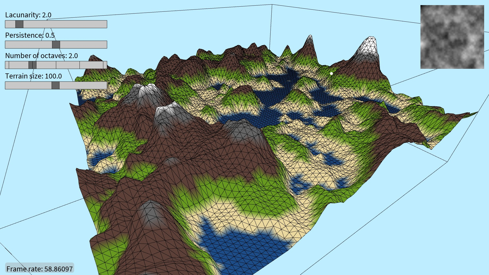

# Terrain generation using Perlin noise

This personal side-project is a [Processing](https://processing.org/) application that generates a dynamic terrain mesh using [Perlin noise](https://en.wikipedia.org/wiki/Perlin_noise). The terrain is rendered with adjustable parameters, allowing for exploration of different landscape shapes and scales.



## 🔬 How it works

### 📖 Perlin noise and terrain generation

The terrain is generated by mapping Perlin noise values to heights on a 2D grid. Perlin noise produces coherent and smooth variations, ideal for natural-looking surfaces like terrains, clouds, or water.

The provided Perlin noise function is a 2D function that yields a number between $0$ and $1$ for each point $(x,y)$.

```math
\text{noise}: \mathbb R^2 \rightarrow [0, 1)
```

The terrain $\mathbf Z$ is the result of $N$ noise maps added together. Each noise map $\mathbf M_i$ is called "octave" and its values are calculated by scaling the noise function by a factor of $p^i$ in the amplitude domain and by a factor of $\ell^i$ in the frequency domain. The $p \in [0,1)$ parameter is known as "persistence" and dictates the octaves amplitude decay, while the $\ell \geq 1$ parameter indicates the octaves frequency growth.

Let $\mathbf Z \in \mathbb R^{s,s}$ be a square matrix of size $s$ containing the terrain's altitude values, its entries $z_{x,y}$ are:

```math
z_{x,y} = \sum_{i=0}^{N-1} m_{i,x,y} = \sum_{i=0}^{N-1} p^i \text{noise}\left( \ell^i x, \ell^i y \right)
```

### 💻 Altitude values computation
The `Terrain` class generates a terrain matrix $\mathbf Z^* \in \mathbb R^{s,s}$ whose altitude values are normalized in the $[0, 1)$ interval. Obtaining $\mathbf Z^*$ from $\mathbf Z$ is non trivial since $|p| < 1$. Indeed, using the [geometric series formula](https://en.wikipedia.org/wiki/Geometric_series), it is possible to determine the maximum _possible_ altitude value $z_{\max}$.

```math
z_{\max} = \sum_{i=0}^{N-1} p^i = \frac{1 - p^N}{1 - p}
```

Therefore, the _normalized_ altitude value $z^*_{x,y}$ at location $(x,y)$ is:

```math
z^*_{x,y} = \frac{z_{x,y}}{z_{\max}} = \frac{1}{z_{\max}} \sum_{i=0}^{N-1} p^i \text{noise}\left( \ell^ix, \ell^iy \right)
```

The normalized altitude value is later multiplied to the chosen maximum altitude value (in pixels) to draw the terrain. 

> [!NOTE]
> Normalizing the altitude values is a design choice that enforced separation of concerns concept and enhanced code quality, readability, and debugging ease.

### 🎨 Terrain rendering
The terrain is draw in a 3D scene by treating the $\mathbf Z^*$ matrix like a 3D mesh. The mesh is drawn by connecting adjacent $(x,y,z)$ points through straight lines using the `beginShape(TRIANGLE_STRIP)` function. The resulting triangles are then colored according to their altitude, simulating different biomes.

To simulate the presence of water basins, each altitude value is clamped to a minimum value, defining sea level.

```math
\max\left( z^*_{x,y}, z_\text{sea} \right)
```

## 📊 Adjustable parameters

The executable allows to adjust different parameters and see in real time how they effect the resulting terrain. Each parameter has a specific effect on the terrain, as shown in the following table.

| Parameter | Symbol | Description |
|:---:|:---|:---|
| Persistence | $p \in [0,1)$ | Specifies how strong is the amplitude difference between octaves. |
| Lacunarity | $\ell \in [1, +\infty)$ | Specifies how strong is the frequency difference between octaves. |
| Number of octaves | $N \in \set{1,2,\dots}$ | Increasing the number of octaves allows to add small details to the terrain. |
| Terrain size | $s \in \set{2,3,\dots}$ | Width and height of the terrain matrix $\mathbf Z$. |

## 🛠 Installation and Usage
The repository contains:

1. Source code (`/source`).
1. Windows executable file (`/exports/windows`).
1. Linux executable file (`/exports/linux`).

[OpenJDK 17](https://adoptium.net/) is needed to run the executables. Alternatively, if you wish to execute (and edit) the source code, all you need to do is:

1. Download this repository.
1. Download the [Processing IDE](https://processing.org/download).
1. Open the repository files with the Processing IDE.
1. Run the sketch.

> [!NOTE]
> Complying with the Processing guidelines, Java access modifiers (e.g., `public`, `private`) have been omitted in the source code. Indeed, they do not have effect in `.pde` files.

## 📄 License

This project is licensed under the __MIT License__. You are free to download, modify, and use the code for personal or commercial projects, provided that proper attribution is given to the original author.

See the LICENSE file for more details.